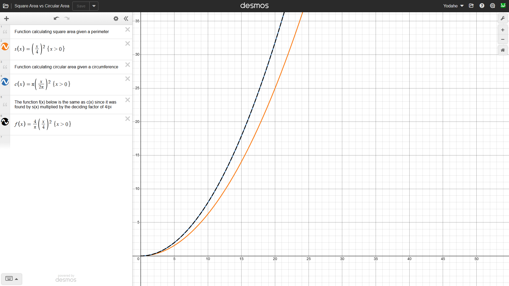
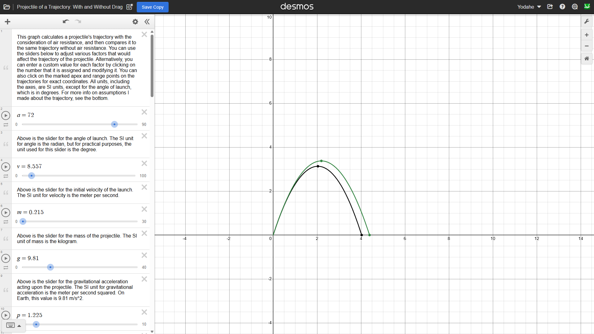
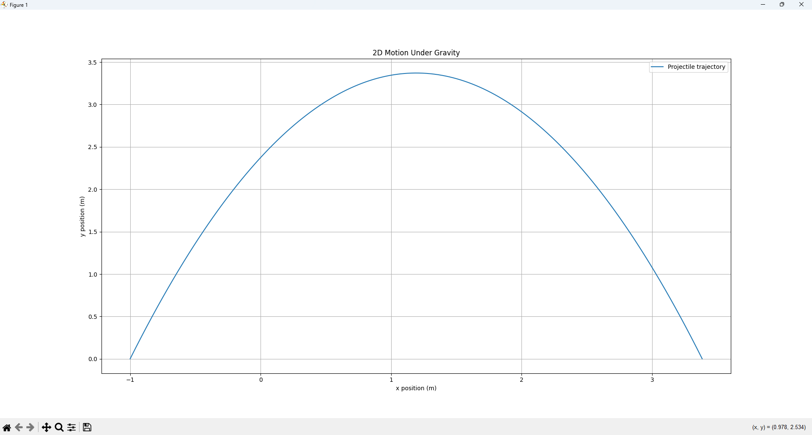
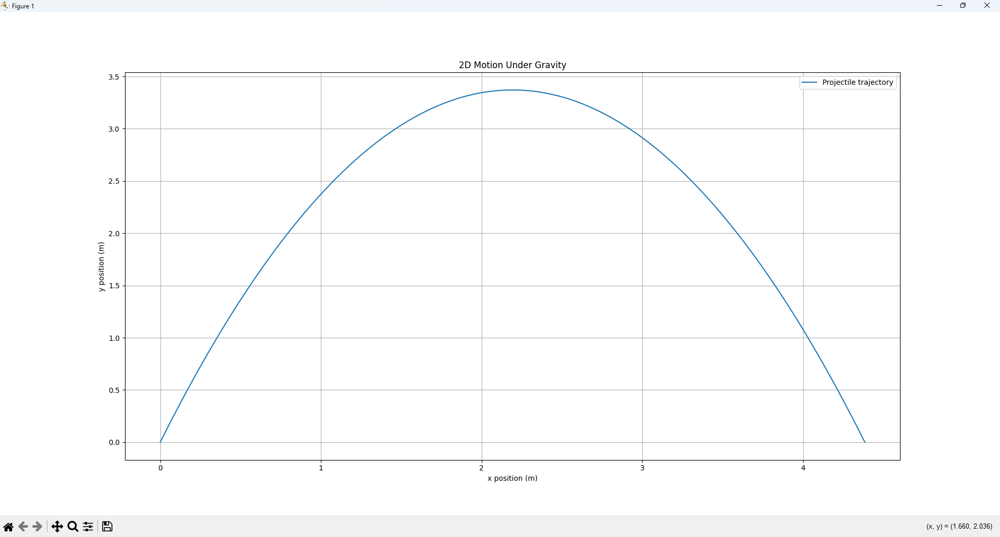
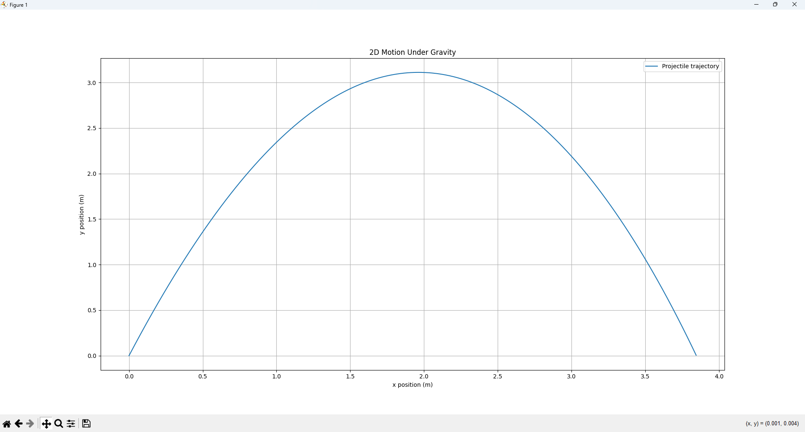

# Understanding and comparing RK4 Integration + air resistance vs. Euler Integration in the context of physical simulations

**Summary:**
- Developed and used a Python script that can calculate and graph trajectories under gravity w/ RK4 integration
- Understood the effect of air resistance on physical simulation's closeness with real-world behavior - especially in FRC

*Wednesday, 5/6/2026*, _3:16PM_

The FRC season has been over for some time now, and it's got me thinking about the things I've accomplished by just starting out. What I've done so far has shown a lot of people new ways to solve problems, and I managed to learn a lot more ways to learn as a result of joining such clubs. Revisiting the physics engine of sorts that created this project in the first place, it brought me to an observation about one overlooked yet cornerstone part in the system.

I'm talking about the integrator that was used previously. As you could see in the past, I had been using Euler integration to calculate plausible trajectories, which didn't account for everything but got the job done for a first run-through. When I researched into other methods of integration, however, one type popped up over and over - Runge-Kutta-4 (RK4) integration.

RK4 integration is a more advanced integration method that utilizes a weighted average to understand what goes on around the curve it's on. Note how it's a more holistic approach compared to taking the next step at face value. It does more with the same timestep length as Euler integration by using one value guided by both early on and later on in its curve. The difference is that RK4 uses four derivative samples - one start, one end, two midpoints - with the points weighted (1, 2, 2, 1) so midpoints matter twice as much. This allows RK4 to "feel" curves in such a way that trusts future behavior more and doesn't cause compounding error - which could have been something that threw off previous trajectory models based on Euler.

This idea for a demonstration led to surprising results that made me rethink the accuracy of all my previous models. RK4 integration seems to be the clearer method with potential for a smaller degree of error. The 0.73% margin of error observed in my FRC lookup table was derived from a method that used blind trust in starting changes and didn't account for air resistance. However, we could unlock an entirely new margin of error when implementing RK4 integration by itself to compare with Euler integration. Today, we're just modeling and comparing because that's the cross-check we need, with one next step being creating a new lookup table with RK4 integration instead of Euler integration and comparing both against real-world behavior.

## Calculations

After doing some research, I found that RK4 integration, when applied to spheres like FRC FUEL, requires you to deal with some projectile properties before the integration fully works as intended. A basic class description for Projectile instances is outlined below:

```
class Projectile:
    def __init__(self, mass, radius, Cd, rho=1.225):
        self.mass = mass                 # kg
        self.radius = radius             # meters
        self.Cd = Cd                     # drag coefficient
        self.rho = rho                   # air density (kg/m^3)
        self.area = np.pi * radius ** 2  # cross-sectional area (m^2)
```

In this case, we are now turning numbers into real objects. We observe mass in kilograms, radius in meters, a drag coefficient of 0.47 for our spheres, and air density in kilograms per cubic meter. We only got away with not needing these in our previous trajectory demonstrations because of two key abstractions made by our FRC team previously: gravity remains the same for all objects on Earth, and _air resistance was negligible when first drafting the lookup table._ But when dealing with spherical objects with circular drag references (I thought the drag reference should have been equal to the spherical surface area, but this assumption was fixed quickly - drag depends on projected frontal area, not total surface area, so `np.pi * radius ** 2` holds here), air resistance need not be negligible.

When dealing with 2D shapes of any given perimeter, findings indicate that circles can enclose a greater area than squares can when both have the same perimeter. In fact, circles are known for enclosing the greatest possible area given any perimeter (or circumference, in a circle's case) when compared to any other 2D polygon. That's why we have such efficient circular pipes and pillars, because they make the most out of perimeter material. To justify using circular cross-sectional area for drag, I compared the enclosed area of circles and squares with equal perimeter, reinforcing why projected area—not full surface area—governs drag.



Based on this as evidence of air resistance's considerable impact, I can safely conclude that when it comes to air resistance on spherical objects, their circular drag references matter as much as square drag references multiplied by 4/pi, signaling that incorporating this into our more accurate RK4 integration is a crucial next-step. I had to implement the newfound cross-sectional area into the RK4 model to ensure accuracy with the real world, and testing these Projectile instances out should prove useful.

# Steps of This Week

1. Implement trajectory_under_gravity.py using RK4 integration instead of Euler
2. Look into the possible benefit of simulating air resistance (such as improving lookup tables)
3. Compare Euler integration with RK4 integration

### Problem(s)
- How do we model a linear algebra-based approach like RK4 in Python and Desmos? _For Python, Numpy should have everything we need to normalize vectors and calculate derivatives. In Desmos, it'll be more of a challenge to use it as a single source of truth when air resistance makes our job harder. However, if we can hardcode air resistance's effect on the Desmos equation directly, then using both mediums can still be beneficial._
- What effect does accounting for air resistance have on ballistic data? _Accounting for air resistance will turn our existing lookup table into a set of maximum values, since the data in our next table would calculate lower initial velocities than what we had previously. Air resistance used to be negligible, but with a realization that spheres are dragged easily by air resistance, a separate model with this in mind could improve first-guess accuracy for our team's shooting._
- How does Euler integration compare to RK4 integration? _Based on reasoning that points to the importance of air resistance and accurate techniques for lowering the margin of error, RK4 integration seems to be the clear winner here. Sure, Euler integration had a margin of error of about 0.73%, but that percentage was with regards to the mathematical solution as opposed to real-world data. What RK4 lets us do is get us closer to the reality of working with said data. The big idea here seems to be that systems can be held to the wrong standard if engineers aren't careful with the difference between theoretical calculations (expectation) and real-world observations (reality), especially in a physically intricate space such as FRC._

****

### Approach

I created a new Python file that works for the same purpose as `trajectory_under_gravity.py`. All you need to do is input your initial state, initial position, and the properties of the projectile in question. In this sort of simulation, we can characterize FUEL more effectively like so:

```
fuel = Projectile(mass=0.215, radius=0.075, Cd=0.47)
```

Referring to the Projectile class, we see how much clearer it will be to work with projectiles now. Everything is organized neatly thanks to the Object-Oriented Programming (OOP) behind this approach. What's more, the modularity associated with creating objects with whatever attributes fit your situation is always a good thing (which we can connect to classes covering OOP such as AP CSA) since we can simulate other types of projectiles if the game pieces used in future FRC years don't have the exact dimensions and properties as this year. Referring to the game manual, FUEL has a diameter of 0.15m and a radius of half of that, so radius = 0.075 (meters). The mass of FUEL is anywhere between 0.203kg and 0.227kg, so I'm using 0.215kg to keep it in the middle. Our starting state will be a numpy array like this: `state = np.array([-1.0, 0.0, 2.644, 8.138])`, where the array is arranged as [x, y, vx, vy]. It should be worth knowing the two driving methods behind our RK4 plot, though.

#### Derivatives

This method can find the derivative of any given state and return a new state where x and y turn into velocities and vx and vy turn into accelerations.
(x, y, vx, vy -> vx, vy, ax, ay) describes how this method works, but it's also worth noting that this is where air resistance is accounted for in our trajectory.

```
def derivatives(state, projectile=fuel):
    x, y, vx, vy = state

    v = np.array([vx, vy])
    speed = np.linalg.norm(v)

    # Forces
    gravity = np.array([0, -9.81 * projectile.mass])

    drag = np.array([0.0, 0.0])
    if speed > 0:
        drag_dir = -v / speed
        drag_mag = 0.5 * projectile.rho * projectile.Cd * projectile.area * speed ** 2
        drag = drag_dir * drag_mag

    force = gravity + drag
    accel = force / projectile.mass

    return np.array([vx, vy, accel[0], accel[1]])
```

The assumptions made here are that gravity will always be the same constant at Earth's surface, and drag is only applied based on the object's speed and not its position. Furthermore, drag makes its way onto the returned state since acceleration will be closer to zero depending on air resistance. (Note that I said "closer to zero" and not just "lower," since the drag direction is opposite to the object's velocity due to `drag_dir = -v / speed` and will go against the dominant force of motion every time.)

#### RK4 Stepping

This method goes through a single step forward in time using RK4 integration to find its way.

```
def rk4_step(state, dt, projectile=fuel):
    k1 = derivatives(state, projectile)
    
    k2 = derivatives(state + 0.5 * dt * k1, projectile)
    
    k3 = derivatives(state + 0.5 * dt * k2, projectile)
    
    k4 = derivatives(state + dt * k3, projectile)

    return state + (dt / 6.0) * (k1 + 2 * k2 + 2 * k3 + k4)
```

Using derivatives given from the previous method, the RK4 stepping method returns a new state. Note that k2 and k3 are each multipled by 2 when computing the resulting state because RK4 weights its averages to trust midpoints more using a (1, 2, 2, 1) ratio.

As for the Desmos approach, I found an open Desmos simulation online that let you compare and contrast projectile trajectories with and without modeled air resistance, and after inputting the same parameters as our matplotlib simulation, that's where we could verify this approach for later. With this integration method in place, we can now start the cross-check before comparing the two integration methods controllably.

### Failure / Debugging
- Bug 1: After configuring the Desmos simulation with drag equations mapped out so that its parameters matched the ones I already had, the resulting graph seemed to overshoot where my simulation took things by ~1-1.09m.


- - Fix for Bug 1: I took a closer look at the zeroes of both Desmos trajectories and realized that although the rightmost zero didn't land close to ours, our leftmost zero was offset to the left by - you guessed it - 1 meter.
For reference, here's the previous trajectory that's using Euler integration (offset left by 1m), ending when the FUEL touches the ground:

And here's the newfound, generated trajectory (offset by the same distance) that implements drag and uses RK4 integration instead:


I normalized both my RK4 trajectory and my Euler trajectory to start at the origin and compared again, and the zeroes ended up closer once again, after removing a normalization issue on my part. (We no longer need the 1m offset like we did when setting up the Euler simulation because our goal here is to match pure numbers. Of course, we're free to offset later if future lookup tables or trajectories require it, but starting at the origin is best practice.) I set the starting x-position in Euler to 0m, and updated the RK4 state to `np.array([0.0, 0.0, 2.644, 8.138])`, resulting in the normalized graphs below. Looks much better, compared to the offset graphs above. What I got wrong at first was thinking that one version of compatibility was bound to work with outside sources if it worked in the Desmos we used. What changed in my thinking was that I now thought of all kinds of constant variables to normalize when I do the Python-Desmos comparison - because control matters.

#### Euler:


#### RK4:


### Results

After fixing the bug, I was able to get a comparison of how accurate my simulation was compared to the Desmos graphs. Using the Desmos graphs as the mathematical backbone, the Euler trajectory still has a very low margin of error -
_(4.38725m - 4.38376m) / 4.38725m x 100 = **~0.08%**._
There's also another margin of error describing Euler obtained from our estimated peak height of 3.37141m -
_(3.37564m - 3.37141m) / 3.37564m x 100 = **~0.13%.**_
As for RK4, its margin of error (with our trajectory ending horizontally at ~3.84535m) evaluates to
_(4.02777m - 3.84535m) / 4.02777 x 100 = **~4.53%.**_
Using RK4 peak height, we get our estimated 3.1109m for our last Desmos comparison -
_(3.13169m - 3.1109m) / 3.13169m x 100 = **~0.66%.**_

_Note: After parameter auditing, I updated the model to use FUEL’s approximate nominal mass (0.215 kg), as defined in the approach above, instead of the initial testing mass (0.27 kg). This adjustment slightly changed the numerical results (~2.69% in horizontal range), but did not affect the overall conclusion._

A few key differences directly arise in ending position. Due to RK4 integration using air resistance in its trajectory, it hits the ground at a shorter horizontal distance than Euler integration does, at ~3.85m instead of ~4.37m in Euler. The peak height is also lower - the FUEL only reaches to ~3.11m instead of ~3.38m. Clearly, RK4 integration leads to a shorter travel path overall (and potentially a more accurate one, since it reasonably accounts for air resistance), but is this an underestimation? Not really, since the shorter travel path is due to the fact that air resistance stops projectile flight early. So why would a simpler approach yield a slightly lower margin of error than a technically correct one when comparing with Desmos?

The answer, as I saw it, lay in the fact that simpler approaches are easier to agree on. Simpler models can appear more accurate when compared against similarly simplified reference models. RK4 approximates the local trajectory using weighted intermediate slopes, which can still accumulate modeling error depending on timestep and force assumptions. However, when it comes to finding the most well-rounded approach - especially one that proves consistency when simulating longer timeframes and externally-impacted trajectories - RK4 integration remains the clear winner. Although RK4 shows slightly higher numerical error in this comparison, it better captures the underlying physics. This is especially so due to the difficulty gap opened by Euler where air resistance is, as we've established earlier, a primary factor in simulation accuracy so long as the margin of error remains in a reasonable range (and ~0.91%-2.09% is indeed reasonable). Choosing the more honest method seems to be the better choice because honest simulations are better at controllably predicting the real-world data we need.

### Answer
**As a physical modeling option, RK4 integration remains more physically faithful than Euler integration due to its accurate change-of-rate computation, and incorporation of air resistance on top of such an integration method (~0.66%-4.53%) when using fixed timesteps.**

The concepts of expectation vs. reality really stuck with me here. Perhaps real-world data will yield even more discoveries, but one telltale sign of overall success is in the fact that digital means do really well at simulating physical phenomena provided they have the mathematical rules to do so.

### Learnings
- Understood projectile physics through OOP where each launched projectile has physics-based attributes and behaviors
- Explored the effects of incorporating air resistance on our overall simulation performance, especially when predicting long-term reliability
- Compared and contrasted the results and steps of Euler integration vs RK4 integration

### References
- https://www.desmos.com/calculator/aixe7zs5vk
- https://www.desmos.com/calculator/on4xzwtdwz
- https://www.firstinspires.org/resources/library/frc/season-materials?view=calendar

Warm regards, and God bless you.

^ Yodahe