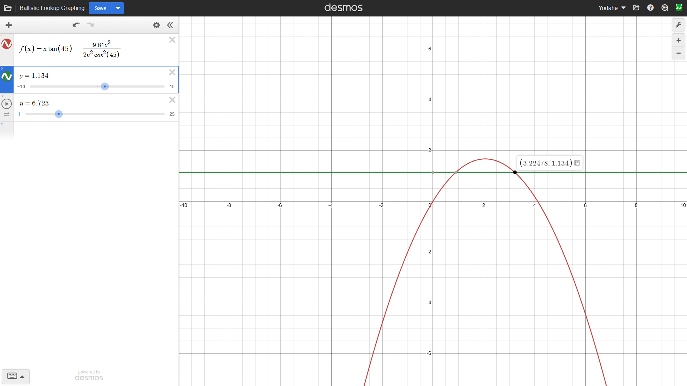
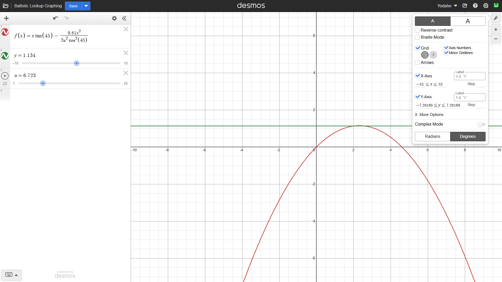
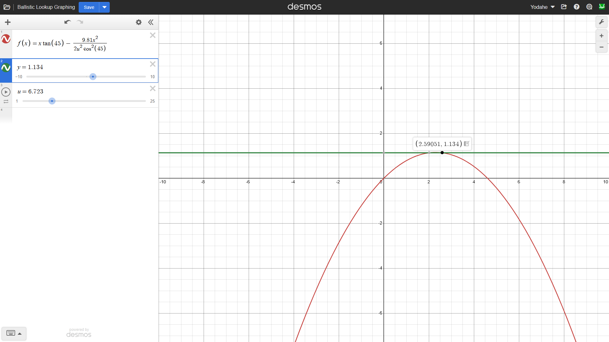

# Applying the "trajectory_under_gravity" simulation to generate a ballistic lookup table

**Summary:**
- Manipulated trajectory_under_gravity.py to find required initial velocity by itself
- Generated numerous distances, paired with initial shooter velocities, to be implemented in an FRC lookup table

*Friday, 2/27/2026*, _12:35 PM_

If you've followed along with my work so far, you know that I've already created a Python simulation to generate graphs of projectile motion given starting positions and initial velocities. I used the simulation to solve one hypothetical scenario — the case where our FRC team had to shoot from a certain distance. I started with a sample distance, where the robot is positioned next to the tower during the game, and gained hands-on experience solving for those distances. Now that I had the framework down, I could work on applying it. This is where the lookup table comes in — the table of distances and initial velocities that will prove crucial during our FRC competitions.

This leads to what we're doing today — generating a model of our distance-velocity relationship so that our numbers can actually be usable. Our last set of metrics was useful in understanding one type of shot that could be made during an FRC competition. However, a single calculated shot is not sufficient during competition. Real robots shoot from varying distances, meaning a dynamic model is required. This motivated me to begin exploring a ballistic lookup table that maps distance to required launch velocity — since that's what brings this out of the theoretical stage.

# Steps of This Week

1. Reframe the projectile motion simulation to solve for initial velocity
2. Generate a ballistic lookup table to be used by an FRC robot
3. Check the results for accuracy so the table can be used in our competitions

### Problem(s)
- How do I rewire a graphing simulation into finding its own constants? _Thanks to the size of our reasonable estimates not being too vast, we can use brute force to loop through different initial velocities. We can then stop the loop when we find the initial velocity that makes our target distance true._
- What physics concepts relate to our application efforts? _The first thing that comes to mind when I encounter a problem like this is reverse kinematics. Reverse kinematics describes the science behind reverse-engineering the physics we see in everyday life. We meet this field when we ask about the kick speed needed to score a goal, or the position needed to sink a three-pointer, or the time needed for a bowling ball to meet the pins head-on - since physics is everywhere in the world around us._
- What implementation details will be similar to those of trajectory_under_gravity.py, and how do they play a role in FRC? _The similar implementation details will be how we're graphing. We learned from the last devlog that not every parabola that meets our goal necessarily meets our real-world goal. In an effort to make sure that our table lines up with reality, we should analyze graphs coming in to make sure they're ...scientifically accurate — and ensure our previous simulation is based on the right physical foundations._

### Approach
I needed to check the foundations before building our lookup table on top of the previous simulation, so I revisited that simulation first. Once that's in place, I'm going to reframe it using the file we're working on today - frc_lookup_table.py - so that it loops through distances and finds the relevant velocities for each one. Of course, if we want this to be our single source of reference while shooting shots in FRC, we want to make sure that the output is scientifically accurate - and we're going to use matplotlib to visualize numbers and fact-check them before they go in.

In retrospect, the steep launch angles and margins of error that appeared in certain graphs within the 2D simulator could have become a problem during competition if we entered without sufficient stability in our model. This means our numbers should work with consistent models, especially since our FRC team starts the lookup table generation process with a launch angle of 45°, then allows for it to be adjusted later. Also note that the target_height used in our simulation is 1.134, since that's the elevation that the goal is approximately at. I'm going to implement this into our lookup table, and see what we get from our graphs.  

### Failure / Debugging
- Bug 1: The numbers between Desmos and the lookup table weren't lining up. The difference between two of the distance estimates — 2.572 m and 3.225 m for the table's given velocity of 6.723 m/s — was hinting at a structural issue in how Desmos was implementing what the simulation said - or how the simulation was mimicking Desmos. Maybe both had some fundamental flaw? I challenged my assumptions and looked into the parameters for both models.

- - Fix for Bug 1: Oops, it was just the settings of the Desmos trajectory. By setting the angle measurement used from radians to degrees (yes, that was the "structural issue"), the Desmos trajectory estimated 2.591 m as the distance at which the ball is scored. It may have seemed like a small bug to list here, but I think it highlights the importance of modularity, since one module's misalignment didn't affect the usage of the other module as a reference point. Confusion would have arisen if both models were wrong in their structure, but if they were both wrong, then yet another approach would have helped me fix them. It made me think about how having multiple ways to solve a problem helps adjacent solutions in turn, so there's some points to ponder there.

### Results

You can find it here: https://www.desmos.com/calculator/kl8slj3mdp

As you can see above, I've been checking over the information outputted by the spreadsheet by inserting the appropriate velocity_m_per_s into a Desmos graph and seeing if the x position on the descent into the target height was close to the distance_m in the same row (we still keep the launch angle at 45 degrees though). I used the test case from the **Fix for Bug 1** to calculate the percent error between the Python simulation's lookup table and Desmos's closed-form physics equation, in order to verify the lookup table's accuracy. In this test case, where the distance is 2.572 m and starting velocity is 6.723 m/s (according to the table), we see that the trajectory graph in Desmos lands on the target height when x = 2.591 m. Taking the difference between the two estimates gives _2.591 m − 2.572 m = 0.019 m,_ resulting in a percent error of _(0.019 / 2.591) × 100 ≈ 0.73%._ This is incredibly accurate for a first run-through, and it can be improved upon further in the future via interpolation of in-between distances. Now that I have something to be used by our team, I can look forward to comparing my lookup table (or someone else's more developed one) with real in-game data once we enter a competition. When theory meets reality, we'll see how consistent estimates truly are.

### Answer
**The implementation details of trajectory graphing fit well into the applications it provides, especially when generating ballistic lookup tables, with a percent error of about 0.73%.**

Once the calculations were fine-tuned to our physical models, it made it pretty intuitive to visualize differing shots in FRC. My team — and other FRC teams, for that matter — can learn something valuable from this experience and potentially streamline their future work. This application is a win-win; I found results, and _we_ found a solution.

### Learnings
- Developed a Python simulation that generates accurate ballistic lookup tables
- Encountered ideas about sources of truth (and what creates them)
- Measured the accuracy of my lookup table compared to real data

### References
- https://www.desmos.com/calculator/kl8slj3mdp

Warm regards, and God bless you.

^ Yodahe