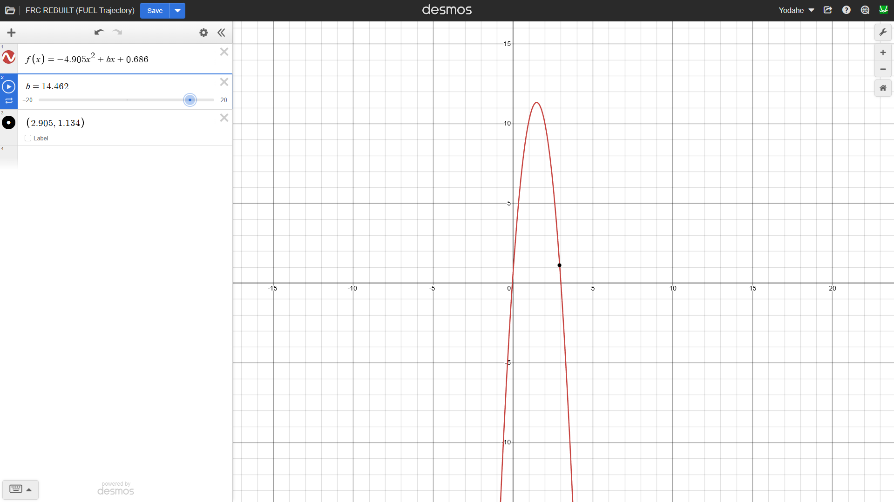
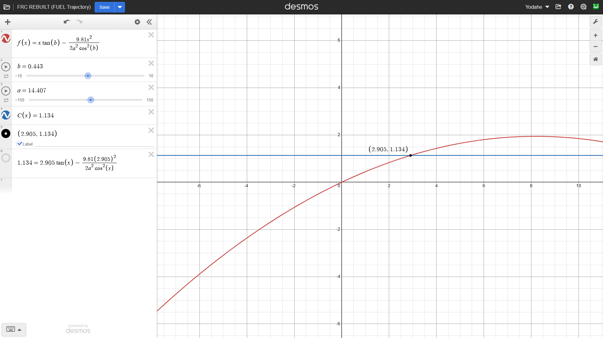
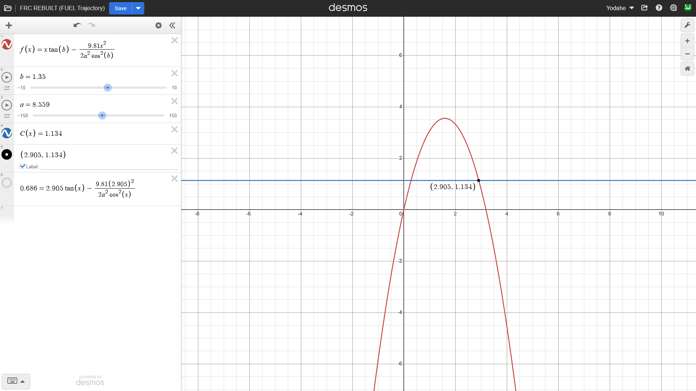

# Building Demonstrations of Math and Physics Intersecting Through Projectile Motion Under Gravity

**Summary:**
- Developed a trajectory simulation file that simulates game piece shooting during FRC REBUILT 2026
- Investigated how much initial velocity at certain launch angles is needed for robots to shoot pieces near tower position

*Friday, 1/16/2026*, _3:33 PM_

The FRC kickoff was just last week, and celebrating it with my team meant I was also celebrating new problems to solve. With that in mind, I was curious as to how the shooters are designed. How does the robot know how much power to put into each shot? This question was pestering me during the last strategy meeting, so I was eager to find out.

## Calculations

Using dimensions from the game manual, the hub's robot-sized "basketball hoop" is 72 in above the ground, and the alliance wall is 158.6 in away from the hub. The hub's hexagonal opening for FUEL (the name of the game pieces used) is 41.7 in wide. Half of this (41.7 in / 2 = 20.85 in) extends the horizontal target distance beyond the 158.6 in measurement. Add the difference between the hub's 47 in width and the hexagonal opening's 41.7 in width, and divide that by 2. That gives us a horizontal margin distance between the edge of the hub and the edge of the opening, (47 in - 41.7 in) / 2 = 2.65 in to be added to the horizontal distance.

On to another factor in this - the tower. It is positioned along the center of the longest alliance wall on the left, and its dimensions are 49.25 in of width sticking out of the wall. Say a robot with a turret shooting mechanism, like the one used by our team (and other teams) in the past, takes its step up to shoot from right in front of the tower, and you add ~18.5 in to the tower's 49.25. (If the drivebase is a bumper-fitting 27 in x 37 in, then a turret in the middle places the FUEL at the center of that, with ~18.5 in separating the FUEL from the sides in front and behind it, assuming that the robot is driving with its shorter sides in front and behind.) Taking all of our width measurements, we get (an approximation of) the horizontal distance of the shot:

_(158.6 in + 20.85 in + 2.65 in) - (49.25 in + 18.5 in) = **114.35 in horizontally**_

And the robot's height limit is 48 in. Let's go with REBUILT's height limit (for now, we can always shrink this number later for shorter robots, especially those trying to go under the trench), which is 30 in. Does that mean our FUEL shoots from 30 in above the ground? No, because the center of the FUEL is a radius-length lower than this. I found a rule saying that robots cannot extend above 30 in at all (R107 in the manual) so we should readjust for FUEL with an equal elevation as the turret. Subtract one FUEL radius, which is a diameter of 5.91 in / 2 = 2.955 in ~ 3 in (for the sake of approximation) and we have 30 in - 3 in = 27 in of height separating the ground from the center of the FUEL. The vertical distance our FUEL must travel is:

_72 in - 27 in = **45 in vertically**_

Alrighty, so we got about 114.35 in of horizontal distance and 45 in of vertical distance for our ball to cover. These aren't exact numbers, and I may have miscalculated a few steps, but these numbers give us a good idea of how each shot will be taken. Brushing up on matplotlib was a great idea as I thought of a way to approach this mathematically.

# Steps of This Week

1. Simulate projectile physics using a python program
2. Apply kinematics to the problem I was trying to solve (how much starting velocity to score from the starting tower?)
3. Present the results to some FRC teammates at our next meeting the following week

### Problem(s)
- How could I accurately model FUEL traveling through the air under gravity? _I could use a basic gravity simulation program that graphs a projectile's trajectory over time. This would allow me to set up a quadratic equation which can eventually give me a case where the trajectory of the ball lines up with the goal's location._
- What physics concepts relate to the problem I was trying to solve? _This connected to kinematics, since we were measuring the 2D motion of objects over time - something that connects quadratics in math with trajectories in physics._
- How much starting velocity, launch angle measure, etc, would be needed for FUEL in FRC REBUILT 2026 to be scored by a teleop driver with their robot near the tower? _I could use graphing tools such as matplotlib and Desmos to graph trajectories, and then I could apply this mathematical reasoning to a physics-based answer using these graphs as my evidence._

### Approach
I chose a model using a quadratic that graphs the FUEL's trajectory over time. Using matplotlib, I could use a cool topic I looked up called Euler integration, which is a simpler integration method that allows for the change in velocity to be the change in acceleration * time, and for the change in position to be the change in velocity * time. Graphing all of the data points and displaying them on a graph, we will have found a physical position in 2D space for our FUEL to reach given some amount of initial velocity that we have to find - remember, 114.35 in horizontally, and 45 in vertically. After setting up the integration and graphing, I can go into Desmos's graphing calculator and use it to solve the quadratic made in our case for the initial velocity's magnitude. Since velocity is a vector, and we would have this vector's magnitude, we can break this vector down into its horizontal and vertical components in order to obtain the numbers needed to reach our goal physically, with my python simulation posing as a helping hand along the way. _There are assumptions to be made, however. For simulation purposes, we are assuming that there's no air resistance, no spin on FUEL, idealized point mass, and a flat launch surface._

_Note: Converting these distances to the physics-accepted SI measurement system gives us about 2.9 m horizontally and 1.14m vertically. These, along with other converted distances, are the distances that I will be using for simulation purposes. I've never seen anyone use inches/second anyways lol_

### Failure / Debugging
- Bug 1: While looking for a relevant initial velocity (I attempted 14.462 m/s when this happened), I was starting to end up with a much higher peak height than what would have actually been useful (like a launch that takes the ball 457 inches up where a cloud is waiting for it).

- - Fix for Bug 1: I normalized the height in each calculator to the 27 inches above the ground that the ball will start at, so the new x-axis isn't at ground level but at turret level. This still gave a peak height of 430 inches, so it was time to check over the available formulas. The one I found that best matches my situation is the projectile trajectory formula, which relates acceleration to the initial velocity instead of assuming a simplified form like ½gt². This led to better results, with the launch height not being too high. However, certain cases led to the launch height actually being too low, to the point where the FUEL touches the goal before reaching its peak height at all, which would lead to the ball bouncing off of the outside and not scoring in a real game.

- Bug 2: After switching to the projectile trajectory formula, the given trajectory is one where the ball hit the target point before reaching its peak height, which means the FUEL's upward velocity would simply bounce off of the hub without being scored in a real game. At an initial velocity magnitude of 14.462 m/s with a launch angle of a shallow-end 27°, the trajectory hit the point on the graph, but wouldn't be capable of dropping down into the hub during a real game.

- - Fix for Bug 2: Was it even possible to make such a shot from the tower? It should be with the right shooter. So what was causing the trajectory's offset? I tried to renormalize the heights, but this time inside of my trajectory equation, I would attempt to solve for a new launch angle and initial velocity where the trajectory of the FUEL is equal in x-position to the hub and equal in y-position to the ground-turret offset from before (0.686m). This led to a new graph being formed - one where the goal was hit not long after the peak height was already met - and none of the numbers were crazy, so I could see the same shot happening in a real game.

### Results

After implementing a quadratic function (with the trajectory formula) in Desmos, I solved for the initial velocity and found that about 8.557 m/s should do it. Substitute this back into the previous equation that let us find our **Fix for Bug 2,** and I used some trig to find a launch angle of about 72° from the horizontal the FUEL was being shot from. Now to find the two components of the vector when _t = 0_ - leading to _2.644 m/s_ horizontally and _8.138 m/s_ vertically. Now we have the components needed to plug into the python simulation. I inputted the vx (initial x-velocity) and vy (initial y velocity) into the starting variables and saw a good representation of the numbers that I compiled throughout my investigation, placing the goal point about a meter back from the origin and very close to the predicted trajectory path. This negative x-position at the start was still realistic, however, because it demonstrated how shooting from a corner of the hub, or shooting from anywhere else farther away in your alliance zone, would work.

You can find my final graph here: https://www.desmos.com/calculator/mwvgucgb1j

### Answer
**The shooter would need to produce approximately 2.644 m/s of starting horizontal velocity and 8.138 m/s of starting vertical velocity at a launch angle of approximately 72° in order to shoot FUEL from areas close to their tower during FRC REBUILT.**

_Note: Despite the realistic numbers, we must note that a 72° launch angle is very steep - especially compared to the widely used 45°. This suggests that a high-arc shooter would be required, potentially limiting shot speed but increasing margin for error vertically. Just something to think about changing up if I ever do apply this._

I'm thankful that I put the time into answering my own question - hopefully I shared the same question as my teammates, because the graphs I have are digital proof of the possibilities.

### Learnings
- Using mathematical reasoning along with programmed simulations in order to model the real world
- Learned the difference between traditional quadratics and the projectile trajectory formula
- Thought up digital methods to present my findings to teammates during the design process

### References
- https://www.cuemath.com/trajectory-formula/
- https://www.desmos.com/calculator/mwvgucgb1j
- https://www.firstinspires.org/resources/library/frc/season-materials?view=calendar
- https://www.khanacademy.org/math/precalculus/x9e81a4f98389efdf:vectors/x9e81a4f98389efdf:component-form/a/vector-magnitude-and-direction-review
- https://www.mathsisfun.com/algebra/vector-calculator.html

Warm regards, and God bless you.

^ Yodahe
